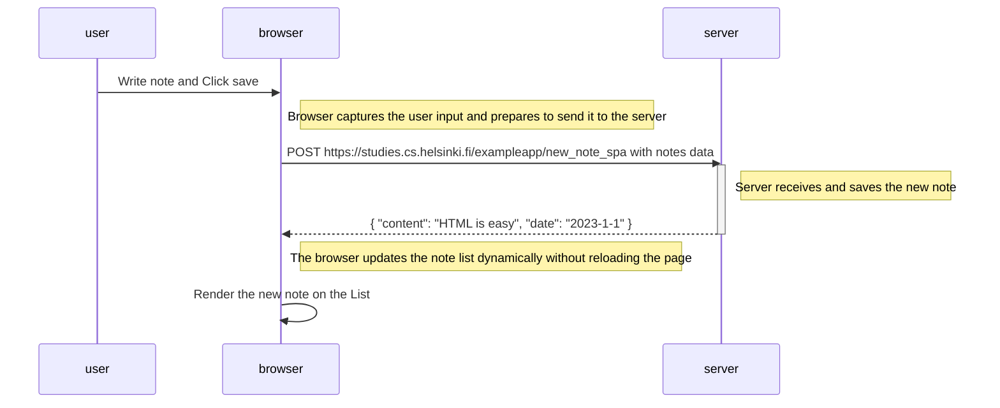

```mermaid
    sequenceDiagram
        participant user
        participant browser
        participant server

        user->>browser: Write note and Click save
        Note right of browser: Browser captures the user input and prepares to send it to the server
        
        browser->>server: POST https://studies.cs.helsinki.fi/exampleapp/new_note_spa with notes data
        activate server
        Note right of server: Server receives and saves the new note
        server-->>browser: { "content": "HTML is easy", "date": "2023-1-1" }
        deactivate server

        Note right of browser: The browser updates the note list dynamically without reloading the page
        browser->>browser: Render the new note on the List        
```