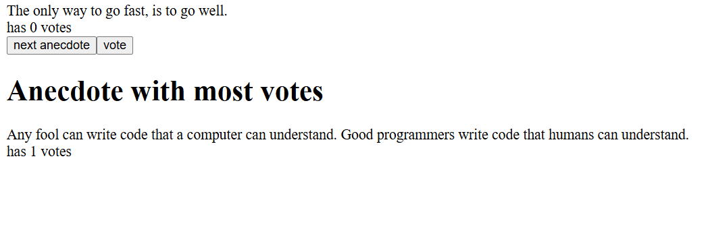

# 🗳️ Anecdote Voting App

A simple React application that displays a list of programming anecdotes and allows users to vote for their favorites. The app also shows which anecdote has received the most votes.

---

## 🚀 Features

- Display a random programming anecdote  
- Vote for the currently displayed anecdote  
- View the anecdote with the highest number of votes  
- Dynamically updates vote counts in real time  

---

## 🧩 Components

### **`App`**
The main component that:
- Manages state for the current anecdote and vote counts  
- Displays the current anecdote and its vote total  
- Includes buttons to:
  - Show a new random anecdote
  - Vote for the current anecdote  

### **`MostVoted`**
A child component that:
- Receives all anecdotes and their vote counts as props  
- Determines which anecdote has the most votes  
- Displays that anecdote and its total vote count  

---

## ⚙️ How It Works

1. **Random Anecdote Selection**  
   The `random()` function generates a random index (0–7) to display a new anecdote when the **Next Anecdote** button is clicked.

2. **Voting Mechanism**  
   The `vote()` function:
   - Creates a copy of the `votes` array  
   - Increments the vote count for the currently displayed anecdote  
   - Updates the state with the new vote array  

3. **Most Voted Anecdote**  
   The `MostVoted` component:
   - Finds the maximum number of votes  
   - Displays the corresponding anecdote and its vote count  


## 🧠 Example Output

```

If it hurts, do it more often.
has 3 votes

[Anecdote with most votes]
Adding manpower to a late software project makes it later!
has 5 votes

```

---

## 🛠️ Technologies Used

- **React** (with Hooks)
- **JavaScript (ES6+)**
- **Vite / Create React App** (for development server, depending on setup)

---

## 🧾 Installation

1. Clone the repository:
   ```bash
   git clone https://github.com/Bilal11123/FullStackOpen-Solutions.git
   cd FullStackOpen-Solutions/part1/anecdotes
    ```

2. Install dependencies:

   ```bash
   npm install
   ```

3. Run the development server:

   ```bash
   npm run dev
   ```

   or (for CRA):

   ```bash
   npm start
   ```

4. Open your browser and navigate to:

   ```
   http://localhost:5173
   ```

   (or the port shown in your terminal)

---

## 📸 Screenshot



---

## 💡 Future Improvements

* Add persistent storage (e.g., localStorage or backend API)
* Include more anecdotes
* Improve UI/UX with better layout and styles
* Add animation for transitions between anecdotes