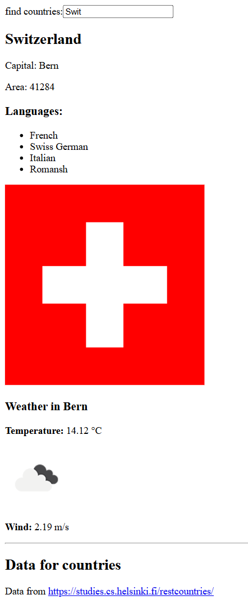

# 🌍 Data for Countries App

A simple React application that allows users to search for countries, view detailed information (like capital, area, and languages), and check the current weather in the capital city using the **OpenWeather API**.

---

## 🚀 Features

- 🔍 **Search countries** by name in real time  
- 🇺🇳 **Display country details** (flag, languages, area, and capital)  
- ☀️ **Show live weather** in the selected country’s capital  
- ⚡ **Uses external REST APIs**:
  - [REST Countries API](https://studies.cs.helsinki.fi/restcountries/)
  - [OpenWeather API](https://openweathermap.org/api)

---

## 🧩 Tech Stack

- [React](https://react.dev/)
- [Axios](https://axios-http.com/)
- [Vite](https://vitejs.dev/) (recommended for development)
- JavaScript (ES6+)

---

## 🗂️ Project Structure

```css
src/
  components/
    Weather.jsx
  App.jsx
  main.jsx
```
## 🚀 Getting Started

1. Clone the repository
```bash
git clone https://github.com//Bilal11123/FullStackOpen-Solutions.git
cd FullStackOpen-Solutions/part2/dataforcountries
```

2. Install dependencies:

   ```bash
   npm install
   npm install axios
   ```

3. Run the development server:

   ```bash
   npm run dev
   ```

4. Open your browser and navigate to:

   ```
   http://localhost:5173
   ```

   (or the port shown in your terminal)

---

## 🌤️ Example Usage
1. Type a country name like Finland in the search box.
2. If there’s exactly one match, the app shows:
    - Country details (capital, area, languages, and flag)
    - Current weather in the capital city
    - If there are multiple matches, use the "show" button next to each country.

## Output
