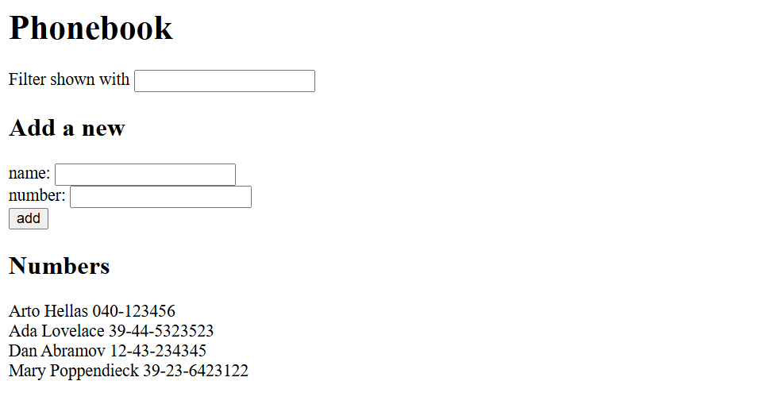

# Phonebook App

A simple React application for managing a phonebook.  
You can add new contacts, filter them by name, and view all saved entries.

## 📦 Features
- Add new contacts with name and phone number
- Prevent adding duplicate names
- Filter contacts by name
- Modular component structure (`Filter`, `PersonForm`, `Persons`)

## 🧠 Components
- **App** – Main component that handles state and logic  
- **Filter** – Input field for filtering contacts  
- **PersonForm** – Form for adding new contacts  
- **Persons** – Displays the list of contacts

## 🚀 Getting Started

1. Clone the repository
```bash
git clone https://github.com//Bilal11123/FullStackOpen-Solutions.git
cd FullStackOpen-Solutions/part2/phonebook
```
2. Install dependencies:

   ```bash
   npm install
   ```

3. Run the development server:

   ```bash
   npm run dev
   ```

   or (for CRA):

   ```bash
   npm start
   ```

4. Open your browser and navigate to:

   ```
   http://localhost:5173
   ```

   (or the port shown in your terminal)

---

## 🧩 Project Structure
```css
src/
  components/
    Filter.jsx
    PersonForm.jsx
    Persons.jsx
  App.jsx
  main.jsx
```
## Output
